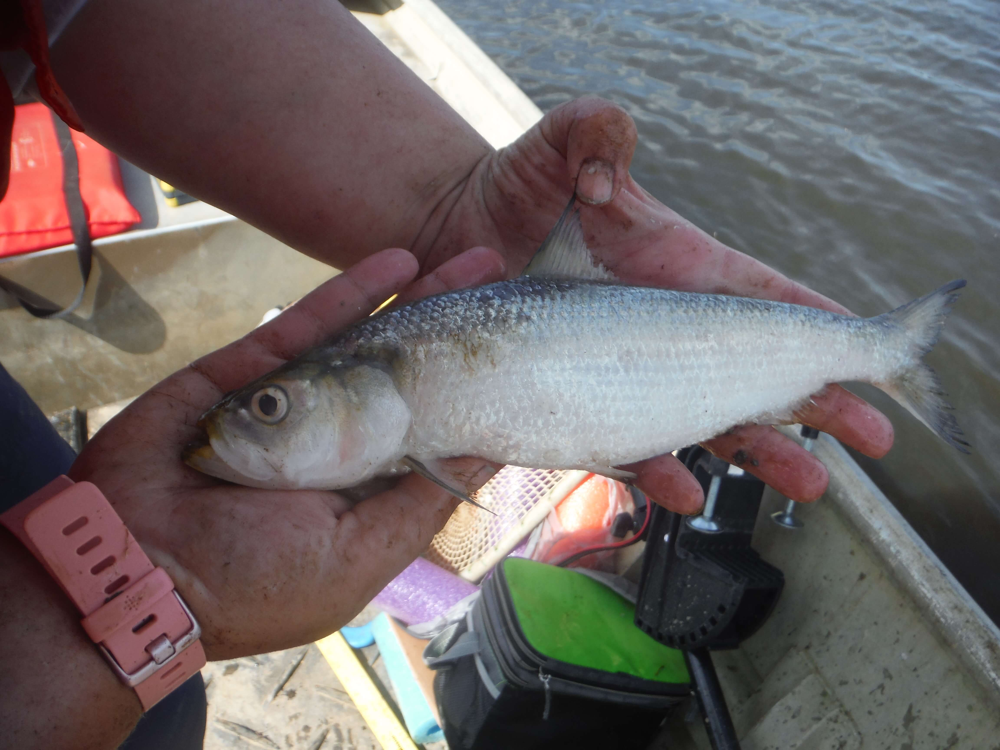
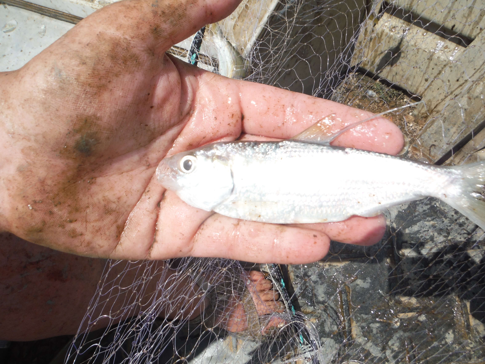

# White Crappie, *Pomoxis annularis*

Follow this link to find out more:   https://nas.er.usgs.gov/queries/FactSheet.aspx?speciesID=408

# Channel Catfish, *Ictalurus punctatus*

Follow this link to find out more:   https://www.nps.gov/miss/learn/nature/channel-catfish-ictalurus-punctatus-and-flathead-catfish-pylodictis-olivaris.htm

# Redear Sunfish, *Lepomis microlophus*

Follow this link to find out more:  https://nas.er.usgs.gov/queries/FactSheet.aspx?SpeciesID=390 

# Smallmouth Buffalo, *Ictiobus bubalus*

Follow this link to find out more:   https://nas.er.usgs.gov/queries/FactSheet.aspx?SpeciesID=361

# Spotted Gar, *Lepisosteus oculatus*

Follow this link to find out more:   https://nas.er.usgs.gov/queries/FactSheet.aspx?SpeciesID=756

# Golden Redhorse, *Moxostoma erythrurum*

Follow this link to find out more:   https://nas.er.usgs.gov/queries/FactSheet.aspx?SpeciesID=365

# Skipjack Herring, *Alosa chrysochloris*

Follow this link to find out more:   https://nas.er.usgs.gov/queries/FactSheet.aspx?SpeciesID=489

# Threadfin Shad, *Dorosoma petenense*

Follow this link to find out more:   https://nas.er.usgs.gov/queries/FactSheet.aspx?SpeciesID=493

# Gizzard Shad, *Dorosoma cepedianum*

Follow this link to find out more:   https://nas.er.usgs.gov/queries/factsheet.aspx?SpeciesID=492

<!-- html comment out
-->
# Also, I've found the following species as well, but I need to get my own pictures! These images have been borrowed from the Sam D. Hamilton Noxubee National Wildlife Refuge Facebook Page.

# Black Crappie, *Pomoxis nigromaculatus*
Follow this link to find out more:   https://nas.er.usgs.gov/queries/FactSheet.aspx?SpeciesID=409

# Flathead Catfish, *Pylodictis olivaris*

Follow this link to find out more:   https://www.nps.gov/miss/learn/nature/channel-catfish-ictalurus-punctatus-and-flathead-catfish-pylodictis-olivaris.htm

# Largemouth Bass, *Micropterus salmoides*

Follow this link to find out more:   https://nas.er.usgs.gov/queries/factsheet.aspx?SpeciesID=401

# Green Sunfish, *Lepomis cyanellus*

Follow this link to find out more:   https://nas.er.usgs.gov/queries/FactSheet.aspx?speciesID=380

# Warmouth, *Lepomis gulosus*

Follow this link to find out more:   https://nas.er.usgs.gov/queries/FactSheet.aspx?SpeciesID=376

# Bluegill, *Lepomis macrochirus*

Follow this link to find out more:   https://www.fws.gov/fisheries/freshwater-fish-of-america/bluegill.html

# Longnose Gar, *Lepisosteus osseus*

Follow this link to find out more:   https://www.floridamuseum.ufl.edu/discover-fish/species-profiles/lepisosteus-osseus/

# Common Carp, *Cyprinus carpio*

Follow this link to find out more:   https://nas.er.usgs.gov/queries/factsheet.aspx?speciesID=4
